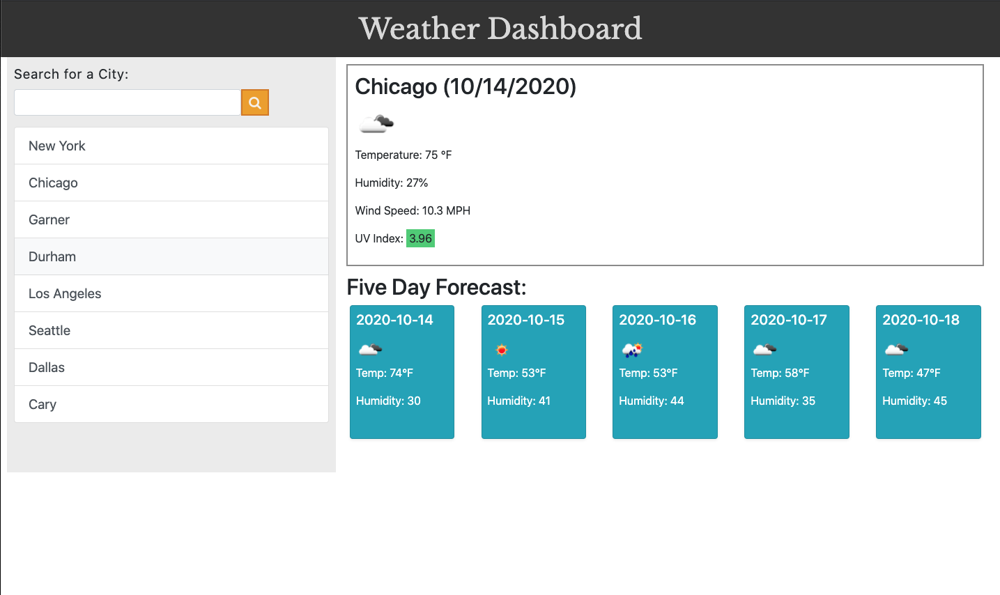

# Weather Dashboard
## A weather dashboard to display current weather and a 5 day forecast.

The weather application displays weather for the searched for city. User simply types into the search the city they wish to search for and the weather will display along with a 5 day forecast. 
Each time the users passes in a new city, the old city is displayed in a list and saved to localStorage. After a user passes in 8 cities, the cities will drop off and it will display the most recent city searched for. 

This application is accessing open weather API and pulling in the information needed to display on the page. 

The application is also using localStorage to store users search. 

The weather dashboard can be accessed here [weather dashboard](https://github.com/pmhagwood/weatherdashboard)
Live site can be accessed here [livesite](https://pmhagwood.github.io/weatherdashboard/)

